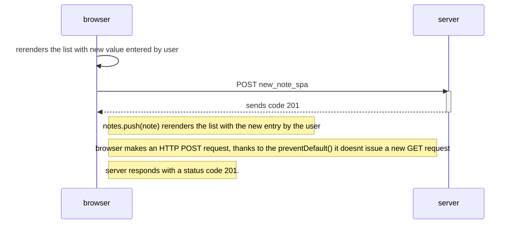

```mermaid
sequenceDiagram
    participant browser
    participant server
    browser->>browser: rerenders the list with new value entered by user
    browser->>server: POST new_note_spa
    activate server
    server-->>browser: sends code 201
    deactivate server
    Note right of browser: notes.push(note) rerenders the list with the new entry by the user
    Note right of browser: browser makes an HTTP POST request, thanks to the preventDefault() it doesnt issue a new GET request
    Note right of browser: server responds with a status code 201.
```